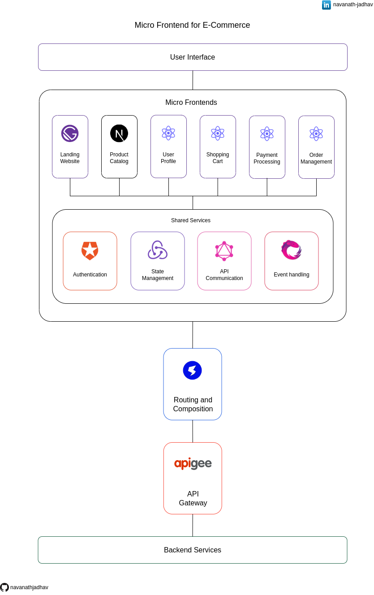

# Micro Frontend for E Commerce

This repository contains the architecture diagram for a Micro Frontend-based E-commerce application. The architecture is designed to provide modularity, scalability, and flexibility by breaking down the application into multiple independent Micro Frontends.

## Give a Star ⭐

If you liked this project or found it helpful then please give it a star.
Thanks.

## Architecture diagram

## Download

Get a [PDF version](./Micro_Frontend_for_E_Commerce.pdf).

## What is Micro Frontend?
Micro Frontend is an architectural approach where a frontend application is decomposed into smaller, self-contained modules that are developed and deployed independently. Each module, known as a Micro Frontend, focuses on a specific functionality and can be built using different technologies. Micro Frontends can be seamlessly integrated to form a cohesive user interface, enabling teams to work independently, improve scalability, and enhance the maintainability of complex frontend systems.

## User Interface

The User Interface (UI) layer is responsible for presenting the application's visual components to users and handling their interactions. It ensures a smooth and intuitive experience by providing an appealing and responsive interface.

## Micro Frontends

The application is composed of several Micro Frontends, each responsible for a specific functionality or feature. The Micro Frontends included in this architecture are:

### Landing Website using Gatsby

The Landing Website Micro Frontend is built using Gatsby, a React-based framework for building static websites. It serves as the entry point of the application, showcasing the main features, promotions, and providing a compelling user experience to attract potential customers.

### Product Catalog using Next.js

The Product Catalog Micro Frontend is implemented using Next.js, a React framework for server-rendered applications. It handles the display and management of the product catalog, allowing users to browse and search for products, view details, and add items to their shopping cart.

### User Profile using React

The User Profile Micro Frontend is developed with React and focuses on managing user profiles, including registration, login, profile customization, and account settings. It ensures a personalized experience by storing user-specific information and preferences.

### Shopping Cart using React

The Shopping Cart Micro Frontend, built with React, enables users to add products to their cart, manage quantities, and proceed to checkout. It provides a seamless and intuitive shopping experience, allowing users to review and modify their cart contents.

### Payment Processing using React

The Payment Processing Micro Frontend, implemented in React, handles the secure processing of payments. It integrates with payment gateways, validates payment information, and ensures a smooth and secure payment experience for users.

### Order Management using React

The Order Management Micro Frontend, developed with React, focuses on managing and processing orders. It allows users to view order history, track shipments, and manage returns or cancellations.

### Shared Services

#### Authentication using Auth0

The Authentication Shared Service employs Auth0, a popular identity and access management platform, to handle user authentication and authorization. It provides secure user authentication, manages user sessions, and ensures that only authorized users can access protected resources.

#### State management using Redux

The State Management Shared Service utilizes Redux, a predictable state container for JavaScript applications. It provides a centralized state management solution, allowing different Micro Frontends to access and update shared application state efficiently.

#### API communication using GraphQL

The API Communication Shared Service leverages GraphQL, a query language for APIs, to facilitate efficient and flexible communication between the Micro Frontends and the backend services. GraphQL enables clients to request specific data and reduces over-fetching or under-fetching of data.

#### Event Handling using RXJS

The Event Handling Shared Service uses RXJS, a reactive programming library, to manage and handle asynchronous events within the Micro Frontend architecture. It enables efficient event-driven communication and provides tools for managing complex event streams.

## Routing and Composition using single-spa

The Routing and Composition layer is implemented using single-spa, a JavaScript framework for building Micro Frontend applications. It handles the routing and composition of the different Micro Frontends, allowing them to coexist within the same application and seamlessly navigate between them. single-spa ensures that the appropriate Micro Frontend is loaded based on the user's actions, providing a cohesive user experience.

## API Gateway using apigee

The API Gateway, implemented using apigee, serves as a centralized entry point for client requests. It acts as a mediator between the client and the Micro Frontends, handling tasks such as request routing, security, protocol translation, and caching. The API Gateway simplifies client-side integration by providing a unified API interface and enhancing the overall performance, scalability, and security of the system.

## Backend Services

Backend Services play a crucial role in supporting the Micro Frontends. These services handle tasks such as data storage, business logic, and integrations with external systems. In the E-commerce architecture, the Backend Services are responsible for functions like order management, payment processing, and other core business operations. They provide the necessary functionality and data required by the Micro Frontends, enabling a complete and functional e-commerce application.

## Conclusion

The Micro Frontend architecture for the E-commerce application offers modularity and scalability. With independent Micro Frontends like the Landing Website, Product Catalog, User Profile, Shopping Cart, Payment Processing, and Order Management, each functionality is developed and maintained separately. Shared services like Authentication, State Management, API Communication, and Event Handling ensure code reusability and consistency. Routing and composition using single-spa and an API Gateway powered by apigee enable seamless navigation and efficient communication. Backend Services provide essential functionality for a comprehensive E-commerce experience.

## Share & Care

If you think this project is helpful share it on [Twitter](https://twitter.com/intent/tweet?url=https://github.com/navanathjadhav/Micro-Frontend-for-E-Commerce).

## Contribute

You are always welcome to help to make this project more knowledgeable and helpful for other developers.

Submit a PR.
